# TurnUptheData

## Team Members

Anna Chee, Jorge Daniel Atuesta, Dan Waehner, Domenic Padulo, Nabila Rizvi

*Special thanks to Will Wright, Erin Willis and Dwight Theieme for their time and support

## Background

Turn Up the Data Co. has hired our team of experts to get a better understanding of how music trends have been changing over the years. They want to make data-driven decisions on what types of music they should invest in as they do budget planning for the upcoming years. Using the Spotify dataset, our team will analyze how popularity of music have changed in the US based on song components and make recommendations to the company based on our findings.

## Introduction

What are music lovers listening to nowadays? How has music changed over the years? How do the various music variables correlate to popularity of the songs, if at all? These are all valid questions to consider when planning future budgets. Our team will investigate these questions using the Spotify dataset and provide insights that will help Turn Up th Data strategize on where they should allocate their funds.

Dive into and join us in this exciting journey across data trends in the music industry!

## Recommendation

To produce tracks with popularity score of 70, which was the average popularity score from the most popular tracks since 1921, we recommend the following attributes to be used:

* Acousticness: 0.5
* Energy: 0.5
* Instrumentalness: 0.1
* Key: 0 (key of C)
* Loudness: -9.9
* Speechiness: 0.1

Based on the linear regression trend on correlation between the attributes and popularity, we suggest the following attributes to create popular tracks in general:

* Acousticness: < 0.5
* Energy: > 0.5
* Instrumentalness: < 0.1
* Key: 0 (key of C) or 7 (key of G)
* Loudness: > -9.9
* Speechiness: < 0.1

## Analysis & Results

The main question we wanted to investigate and answer was: is there a relationship between music attributes and the popularity of the song?

The datasets we used contain data from 160k+ tracks on Spotify that were released between 1921 and January of 2021.

Prior to our analysis, we explored the parameters in the dataset and reduced the sample size to narrow our focus to top trending songs only. We then cleaned the reduced dataset by adjusting the data types and renaming columns accordingly. After this step was done, we had a clean dataframe to effectively analyze correlation between music attributes and popularity of the songs as well as trend of music attributes over the past years.

Below were our hypothesis and null hypothesis for the main question:

* Hypothesis – There is a relationship between the attribute and popularity of a song
* Null hypothesis- There is no relationship between the attribute and popularity of a song

After our hypothesis was created, we ran a Pearson correlation test to see if there was sufficient statistical evidence to reject the null hypothesis for each attribute that was being tested against popularity. We established our alpha value to be 0.05.

The correlation heatmap below allows us to visually see if there are correlations bewteen the variables and the song popularity index. If the square is green it means there is a positive correlation, yellow no correlation and red negative correlation. This is based out of the pearsons correlation matrix. 

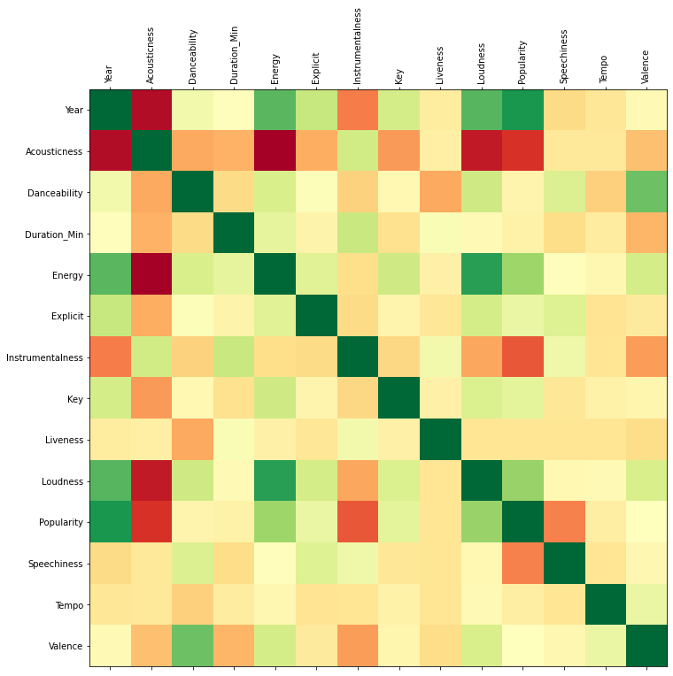

With the Pearson correlation test results, we found out that the following attribtues were the only ones that had enough statistical evidence to prove that they do have a relationship with song popularity:

* Acousticness
* Energy
* Instrumentalness
* Key
* Loudness
* Speechiness

The graphs below show correlation between music attributes that were found as statistically significant and popularity:

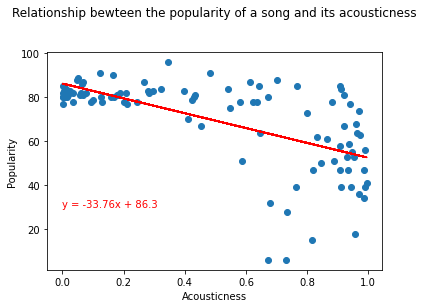

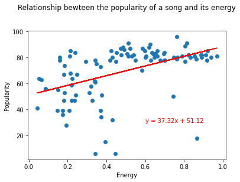

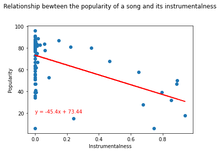

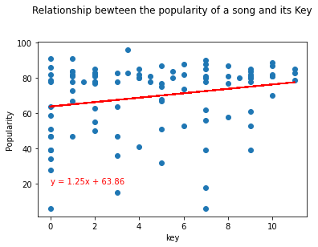

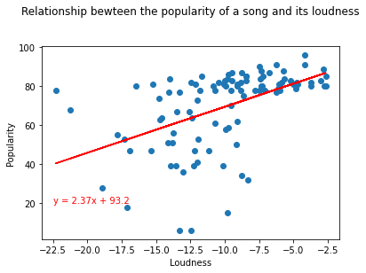

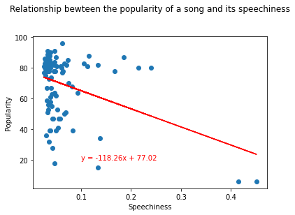

The graphs below show average values over time for attributes that were found as statistically significant:

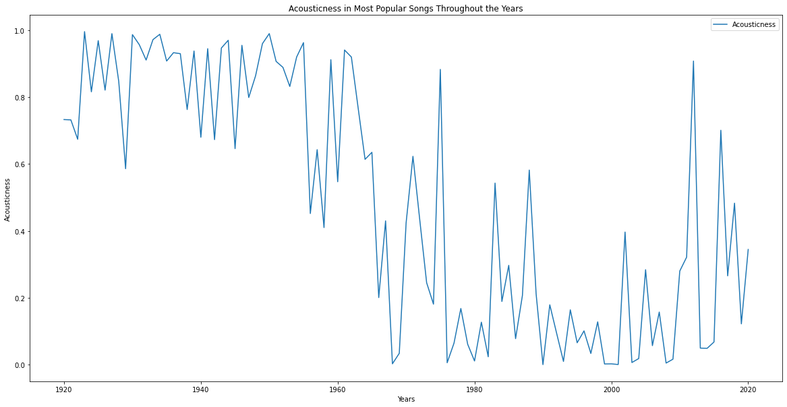

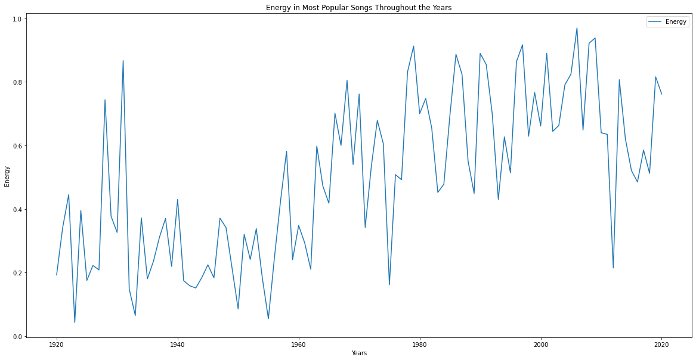

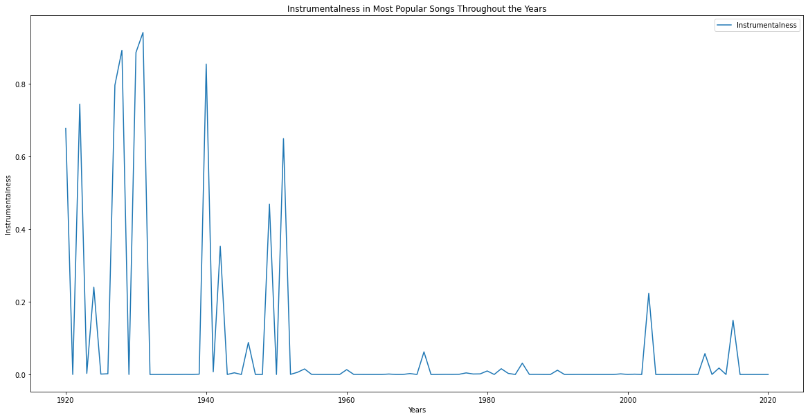

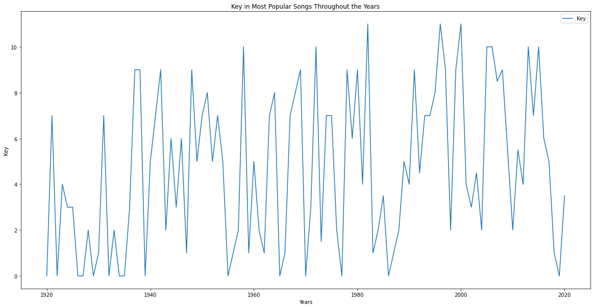

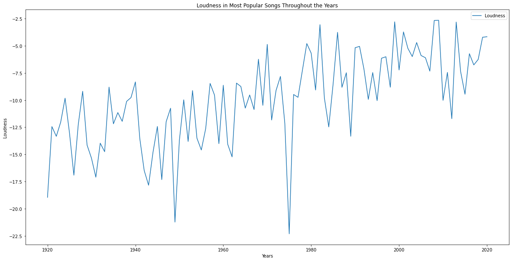

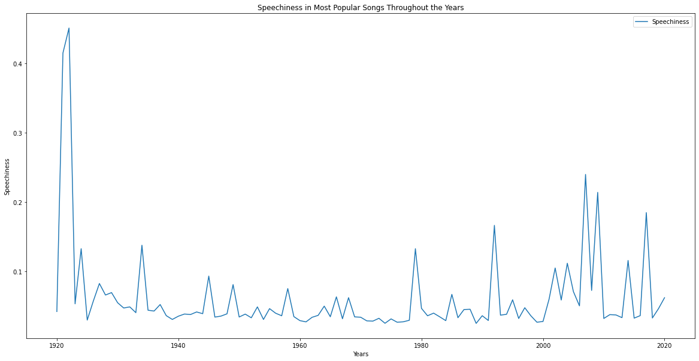

The other attributes ('Danceability', 'Duration_Min', 'Explicit', 'Liveness', 'Tempo' & 'Valence') did not have enough statistical evidence to reject the null hypothesis, and therefore, they do not have a relationship with song popularity.

## Source

Kaggle Spotify datasets (https://www.kaggle.com/yamaerenay/spotify-dataset-19212020-160k-tracks)
